## 프로젝트 개요
2022년에 블루투스(Bluetooth)를 이용해 원격으로 금고를 제어할 수 있는 프로그램을 아두이노(Arduino)를 이용해 구현했습니다.

## 활용 기술
```
Arduino
Bluetooth
C/C++
```

## 코드 실행
```
Project_All_Code.ino
```

## 하드웨어
### 1. 기능별 사용 부품 
1.	금고 잠금/열림 기능 : 9g 미니 서브모터 SG-90 1개
2.	블루투스 통신 기능 : HC-06 모듈 1개
3.	진동을 통한 절도 여부 파악 기능 : 진동센서 1개
4.	리셋 버튼/세팅 버튼 : 푸시버튼 2개, 10K 저항 2개
5.	경고음 기능 : 수동 부저 1개, S8050 NPN 트랜지스터 1개, 10K 저항 1개
6.	금고 잠금/열림 상태 표시 기능 : 빨간색/녹색 LED 1개, 1K 저항 2개<br/><br/>

### 2. 제작과정 & 하드웨어 구현
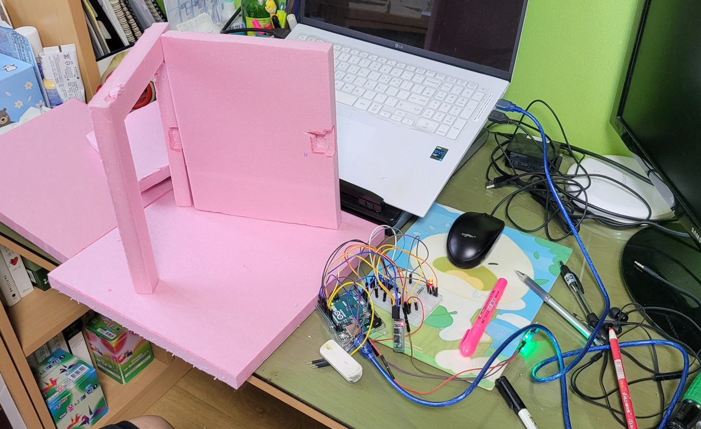<br/>
- 아두이노와 브래드보드(Breadboard)에 세팅을 마치고 단열재를 이용해 금고를 제작함.
- 벽면엔 금고의 잠금장치 역할인 서보 모터가 들어갈 공간을 확보함.<br/>

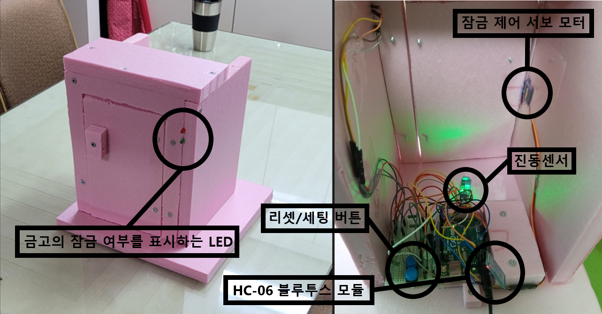<br/>
- 금고 정면 우측 상단에 금고의 잠금 여부를 표시하는 2개의 LED 핀을 부착함.
- 금고 내부 좌측에 금고의 잠금을 제어하는 서보 모터를 부착함.
- 금고 내부 하단 중앙에 금고의 진동 여부를 파악하는 진동센서 부착함.
- 원격 조정을 위한 HC-06 블루투스 모듈을 금고 내부에 설치함.
- 금고의 비밀번호를 리셋/세팅하는 푸시버튼을 금고 내부에 설치함.<br/><br/>

## 소프트웨어
### 1. 개요
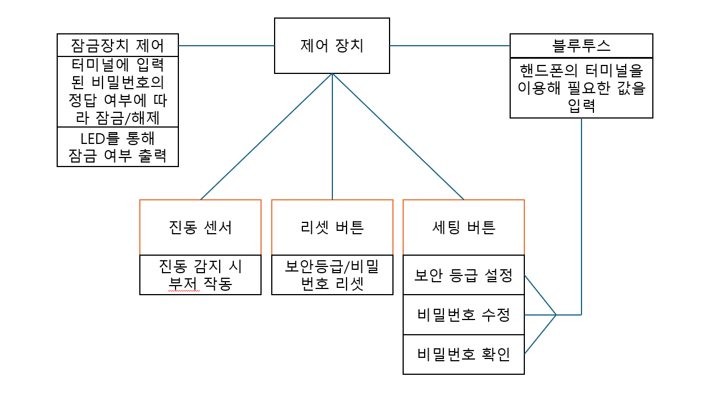<br/>
1.	블루투스를 이용해 핸드폰 아두이노 앱의 터미널에서 비밀번호를 입력하여 금고의 문을 열고 닫을 수 있음.
2.	세팅 버튼을 통해 터미널 화면에 보안 등급의 설정/비밀번호 수정/현재의 비밀번호 세팅 상태를 핸드폰의 터미널에서 확인 가능함.
3.	리셋 버튼을 통해 보안 등급과 비밀번호를 초기 설정 상태로 전환할 수 있음.<br/><br/>

### 2. 기능 소개
#### 1. 잠금/해제
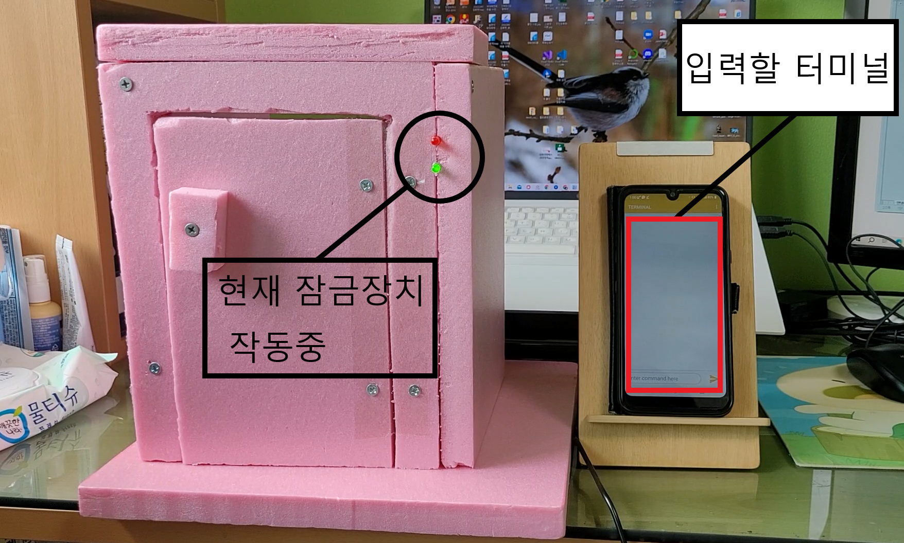<br/>
- 핸드폰의 Arduino Bluetooth Controller 어플리케이션을 이용해 터미널로 금고를 제어함.
- 금고 우측 상단의 LED를 이용해 잠금장치의 해제 여부를 확인함. 현재는 녹색 LED가 불이 들어와 있으므로 잠금장치가 작동 중임.<br/><br/>

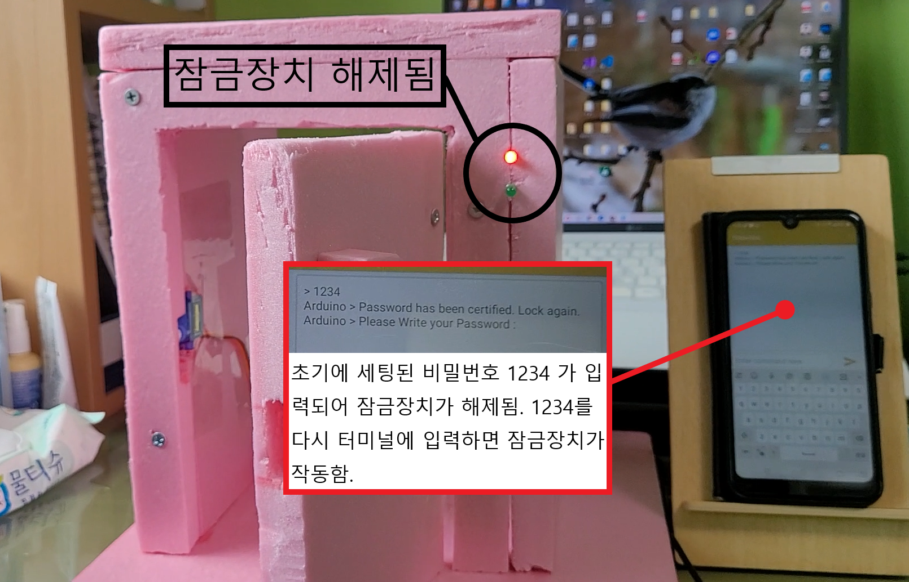<br/>
- 기본 세팅한 비밀번호 1234를 터미널에 입력하여 금고의 잠금장치를 해제함.
- 붉은색 LED가 등이 들어왔으므로 정상적으로 금고의 잠금장치가 해제된 것을 확인 가능함.<br/><br/>

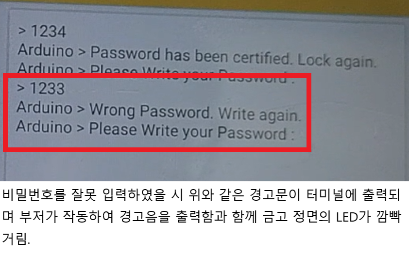<br/>
- 터미널에 비밀번호를 잘못 입력할 시 이미지와 같은 경고문이 터미널에 출력됨.<br/><br/>

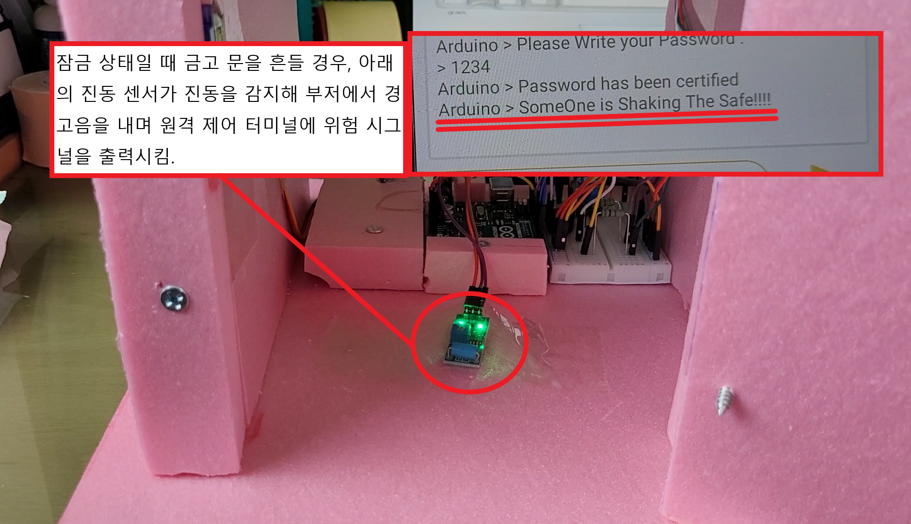<br/>
- 잠금 상태일 때 금고를 흔들 경우, 진동 센서가 금고의 흔들림을 감지해 사용자에게 불법적 접근이 있음을 터미널에 경고함.<br/><br/><br/>

#### 2. 보안 설정
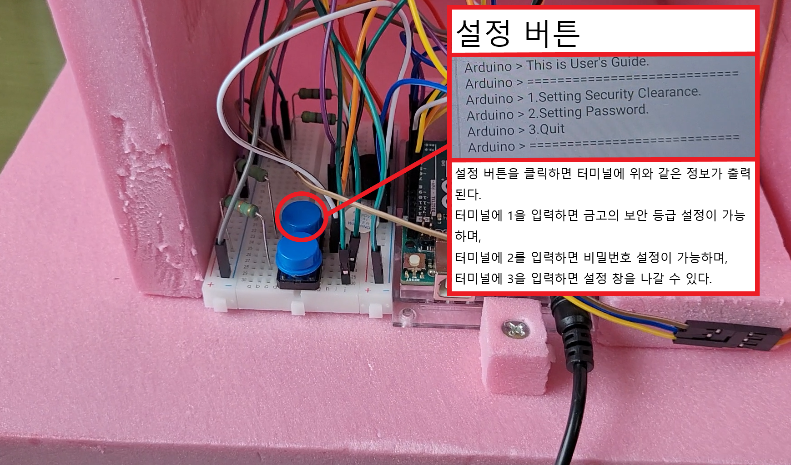<br/>
- 설정 버튼은 2가지 기능을 지원함.
1. 보안 등급 설정  
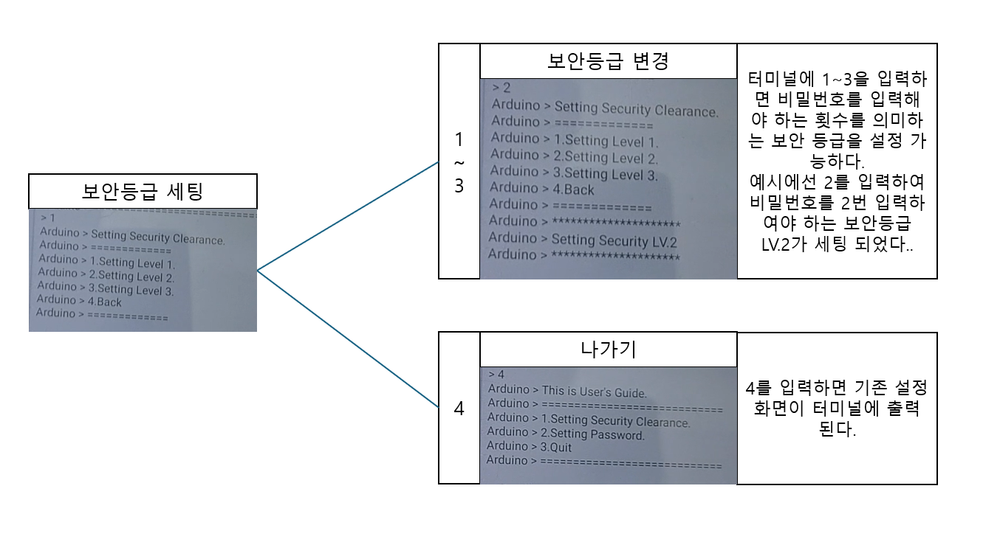<br/>
- 터미널에 1을 입력하면 보안 등급을 설정할 수 있음.
- 보안 등급은 1~3까지 지원되며 숫자에 따라 입력해야 할 비밀번호의 횟수가 결정됨.<br/><br/>
2. 비밀번호 설정<br/><br/>
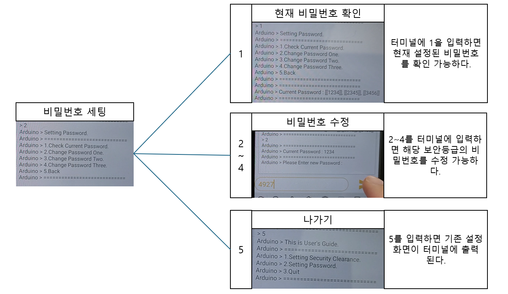<br/>
- 터미널에 2를 입력하면 비밀번호를 설정할 수 있음.<br/><br/><br/>

#### 3. 리셋
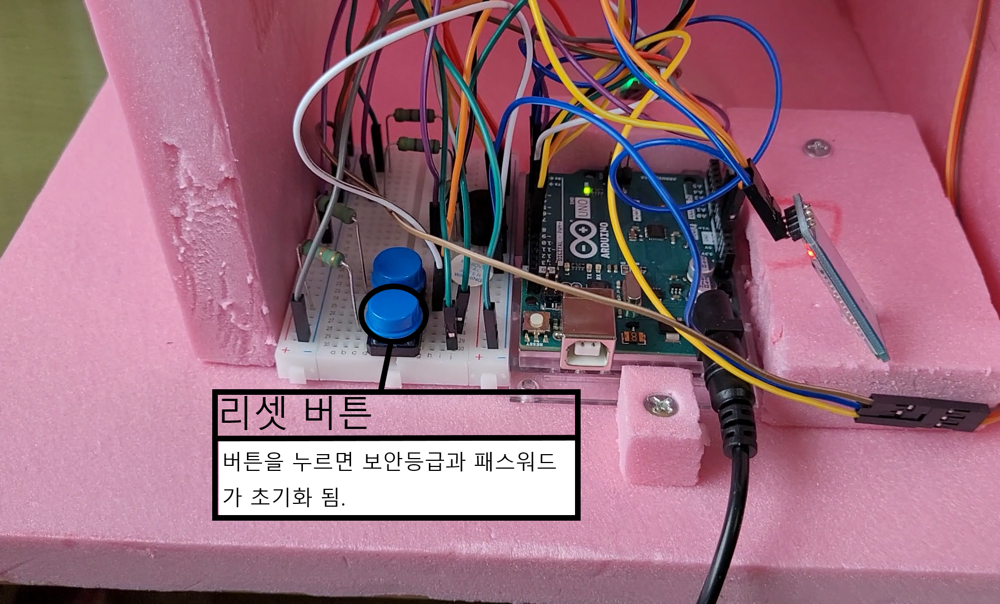<br/>
- 리셋 버튼을 누르면 보안 등급은 1, 비밀번호는 1234로 초기화됨.<br/><br/><br/>

## 결론
- 아두이노와 블루투스를 이용해 금고의 잠금장치와 보안을 원격으로 제어하는 기능을 구현함.<br/><br/>

## 향후 목표
1) 사용자의 핸드폰이 탈취될 가능성을 고려해 잘못된 비밀번호가 일정 횟수를 초과해 입력될 경우 금고를 강제적 잠금 상태로 전환하는 기능 구현.
2) 금고를 탈취하는 경우를 대비해 금고 내부에 GPS 장치를 추가. 
3) 원격 제어 이외에 수동으로 비밀번호를 입력할 수 있는 수단 구현.
<br/><br/>

## 참고 문헌
금고의 필요 기능에 대한 참고 : https://patents.google.com/patent/KR20140138418A/ko <br/>
블루투스 전송 코드 참고 : https://codeda.tistory.com/95 <br/>

